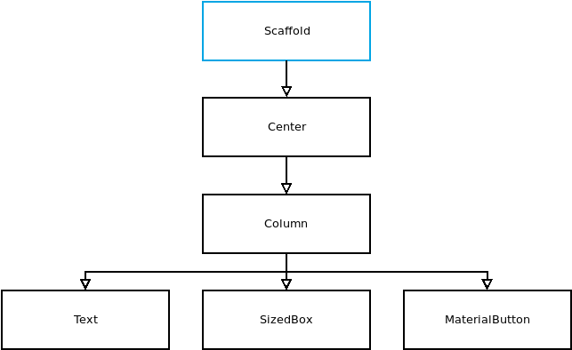

= Bocattos
José Luis Barros
v. 0.2.0, 2019-NOV-12

== Wiki - Notas técnicas de la aplicación

=== Fondo de la aplicación
La versión de inicial presenta simplemente un fondo de color azul.
En esta versión dicho fondo se cambia por una imagen alusiva al propósito de la aplicación.

El color azul se define en la propiedad `backgroundColor` dentro de `Scaffold` en nuestro método `build()`. Para desarrollar una pantalla que incluya actividad de IU, necesitamos `Scaffold` como widget principal. Como el constructor de la clase `Scaffold` solo espera un único widget en la propiedad `body`, pasamos un objeto `Center` (para centrar los) que incluye un `Column` para poder pasar una lista de widgets a su propiedad `children`:

Para cambiar el fondo de nuestra pantalla a una imagen, primero debemos incluir el archivo de imagen en nuestro proyecto. Creamos un directorio `assets` en el directorio raíz de nuestro proyecto y colocamos el archivo de imagen allí. La foto la podemos descargar de link:https://unsplash.com/photos/wMzx2nBdeng[unsplash].

Vamos a utilizar el directorio `assets` para almacenar todos los archivos a los que nuestra aplicación puede acceder en tiempo de ejecución. Como todos estos archivos son imágenes en nuestro caso, no necesitamos ningún otro subdirectorio en el directorio de activos.

La imagen de fondo pasa a ser un recurso de la aplicación y como tal debe registrarse en el archivo `pubspec.yaml` en la sección `assets` del apartado de `flutter`.

Definimos todos los metadatos y las dependencias de la aplicación en `pubspec.yaml`. Estas dependencias pueden ser paquetes, fuentes o imágenes.

Para establecer la imagen como imagen de fondo de nuestra pantalla de inicio de sesión, vamos a ajustar nuestro widget `Center` en el widget `Container` y usamos su propiedad `decoration`.